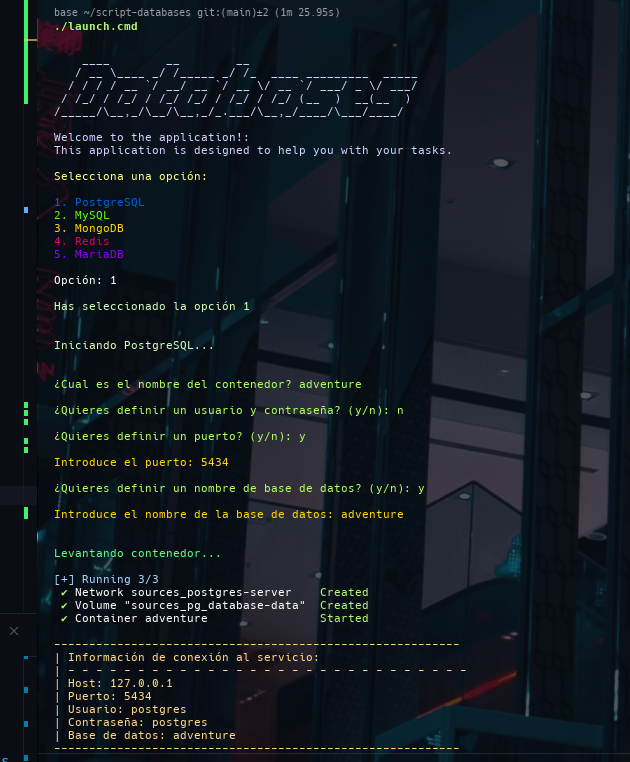

# Script de automotización de bases de datos

Este proyecto tiene como objetivo automatizar la creación de bases de datos y la carga de datos en ellas. Utilizanddo las herramientas de
Docker y Docker Compose, se busca facilitar la gestión de bases de datos en entornos de desarrollo.

## Ejecución

Para ejecutar el script, asegúrate de tener Docker y Docker Compose instalados en tu máquina. Luego, sigue estos pasos:

Para ejecutar en linux

```bash
chmod +x ./launch.cmd
````

```bash
./launch.cmd
```

## Screenshots


